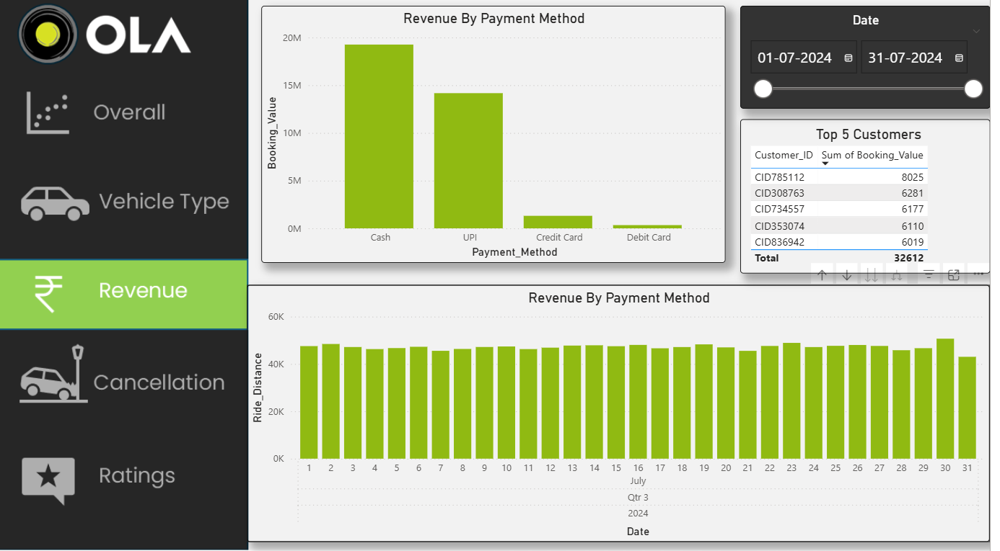
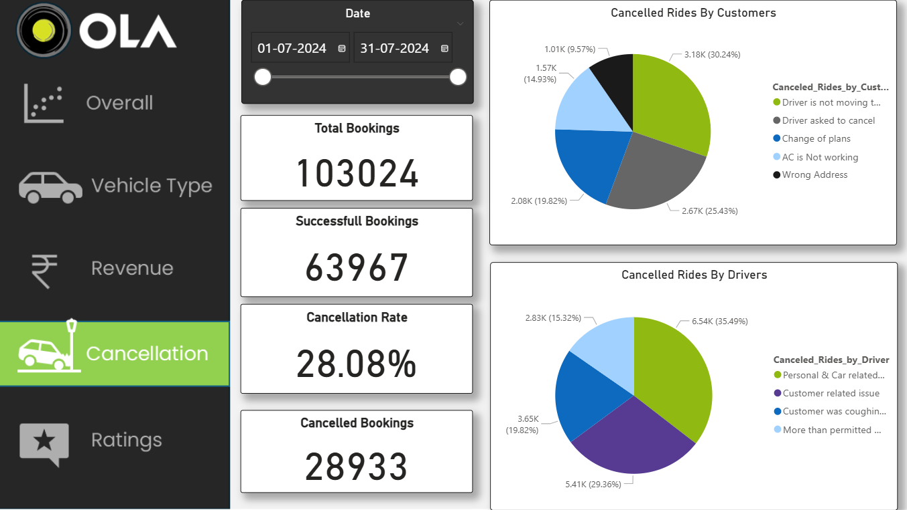
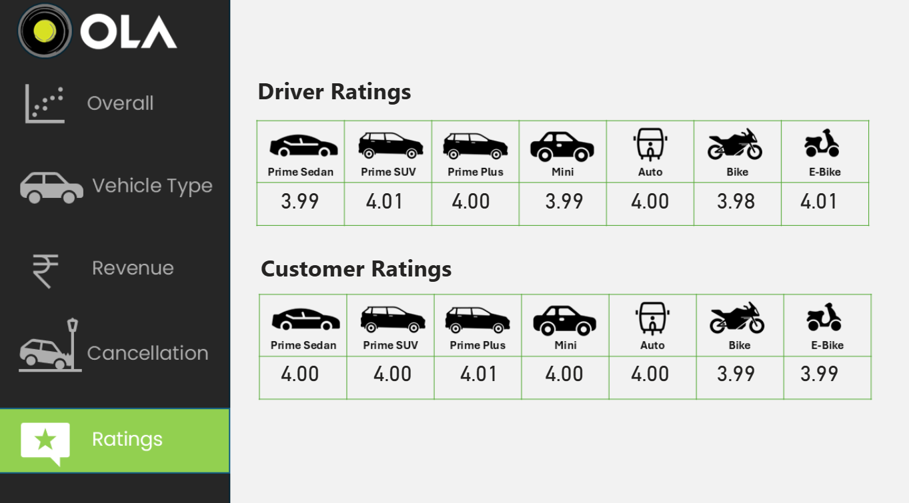

# Ola-Ride-Analytics-Dashboard
# Ola-Ride-Analytics-Dashboard

The Ola Ride Analytics Dashboard is a comprehensive data-driven project leveraging SQL, Excel, and Power BI to analyze 100,000+ ride-booking records. It provides deep insights into total bookings, revenue trends, cancellations, and customer ratings, enabling stakeholders to make informed, data-driven decisions.

## 📊 Dashboard Preview

### Main Dashboard Overview

### Vehicle Type Analysis

### Revenue Analysis

### Cancellation Analysis  

### Rating Analysis

## 📊 Key Features

✅ *Data Analysis*: Processed raw ride data using SQL & Excel  
✅ *Dashboard Visualization*: Designed in Power BI with pie charts, graphs, and KPIs  
✅ *Key Insights*:
- *Total Bookings*: 📊 103,024
- *Total Revenue*: 💰 ₹35M
- *Cancellation Rate*: ❌ 28.08%
- *Customer Ratings & Trends*

## 🛠 Tech Stack Used

- *SQL* – Data extraction and preprocessing
- *Excel* – Data cleaning and exploratory analysis  
- *Power BI* – Interactive dashboard development

## 📂 Project Files

- ola_project.sql – SQL queries for data extraction
- ola_100000_dataset copy.xlsx – Raw ride dataset  
- OLA_Project.pbix – Power BI dashboard file
- Dashboard screenshots – Visual representations of key insights

## 🚀 How to Use

1. Load the dataset (ola_100000_dataset copy.xlsx) into SQL/Excel
2. Run ola_project.sql to extract insights  
3. Open OLA_Project.pbix in Power BI to explore visualizations
4. View the dashboard images above for a quick overview of key metrics

## 🏆 Key Insights & Analytics

### Revenue Analysis
- *Total Revenue Generated*: ₹35M across 100,000+ rides
- Revenue distribution across different vehicle types
- Peak revenue periods and seasonal trends

### Cancellation Analysis  
- *Overall Cancellation Rate*: 28.08%
- Cancellation patterns by time, location, and vehicle type
- Impact analysis on revenue and customer satisfaction

### Vehicle Type Performance
- Performance metrics across different vehicle categories
- Popular vehicle types and their contribution to revenue
- Utilization rates and efficiency analysis

### Customer Rating Insights
- Customer satisfaction trends and rating distributions  
- Correlation between ratings and various service parameters
- Feedback analysis for service improvement

## 🏆 Outcome

This project provides a comprehensive analysis of Ola rides, allowing stakeholders to:
- Monitor performance metrics in real-time
- Identify cancellation patterns and root causes
- Track revenue trends and optimize pricing strategies  
- Understand customer satisfaction and improve service quality
- Make data-driven decisions for business growth

## 🔍 Technical Implementation

The dashboard combines multiple data visualization techniques:
- *Interactive Charts*: Pie charts, bar graphs, and line charts for trend analysis
- *KPI Indicators*: Real-time metrics display for key performance indicators  
- *Filtering Options*: Dynamic filtering by date, vehicle type, and location
- *Drill-down Capabilities*: Detailed analysis at granular levels

---

This project demonstrates proficiency in data analytics, visualization design, and business intelligence using industry-standard tools.
